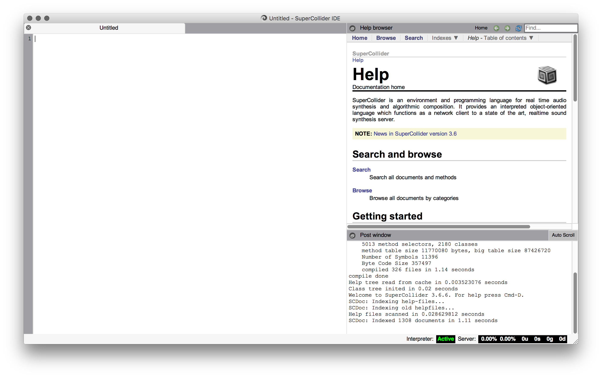

# Tutorial for Sonification in SuperCollider

This document will introduce you to producing audio representations of
data. In our example, the data will be about the cost of consumer
goods and average hourly pay, but your data can be about anything you
want. The tutorial should be quick to go through, so we encourage you
to complete it first and then use the code to make your own version.

It's broken up into lessons which you can complete in one sitting,
either as part of a class, or by yourself.

## Lesson 1: Install SuperCollider and Make It Beep

SuperCollider provides an integrated development environment for doing
real time audio synthesis. It's a fairly complete system with a long
history and has been released under the GNU General Public
License. So, time you spend time learning to use it won't be
wasted. You should be able to continue to use it in the future. We
will begin by downloading and installing it.

Point your browser to
[supercollider.github.io](http://supercollider.github.io) and click
download, select your platform, and run the installer. For this
tutorial, we're using 3.6.6, but newer versions should be that
different.

After installing SuperCollider, you should be able to run the program
and after a few things run, your screen should look something like:

This is the integrated development environment, or IDE, for the whole
system that gives you access to a help browser in the upper right,
logs of activity in the lower right, and the programs on the left. If
it seems more complicated than what you're used to, don't
worry. SuperCollider has a somewhat different approach than a
conventional compiler or a word-processor. It uses a client-server
model that is organized by the IDE. This means that the "interpreter",
the client program, reads what you wrote and tells tells the server
program what sounds to make and then the server makes those sounds.

You can see the status of the interpreter in the lower right. It says
active. The server isn't started by default and there are a few ways
you can do it. On a Mac you hit command-B to "boot" the server
(control-B on Windows or Linux) or you can click on "Boot server" in
the Language menu. Alternatively, you can simply right click on the
server status and select "Boot Server." Do that now. You should be
able to tell it's booting if you see some new lines in the log in the
lower right. It should end with something like:

     SuperCollider 3 server ready.
     Receiving notification messages from server localhost
     Shared memory server interface initialized

(Note that there's a tutorial you can do in the upper-right
documentation window, but we don't need everything it covers for our
sonification. However, if you're doing this in class and want to work
ahead, go for it, but it's probably better to come back to the
tutorial after you've finished this one.)

Now that the server is started, let's make a sound. In the big blank
space on the left type the following:

     { [SinOsc.ar(440, 0, 0.2), SinOsc.ar(442, 0, 0.2)] }.play;

Nothing is happening because you haven't told the interpreter to
interpret it and send the messages to the server to make
sounds. We're going to do that shortly, but first you need to know how
to make it stop. Memorize this keystroke: command-. (that's period) or
control-. (if you're on Windows or Linux). If you forget, you can find
it in the Language menu under "Stop." When you get into trouble, you
can *always* hit this keystroke to tell the server to stop
everything. As you experiment, you'll find this very useful.

Now, put your cursor on the line of code and hit command-return on Mac
or control-return on Windows or Linux (or select Evaluate from the
Language menu). It should start a nice beep. When you're tired of
hearing it, stop it by choosing that menu item or the keystroke you
memorized from before.

Let's try to understand the code. The developers use an
object-oriented style for the SuperCollider language which means that
each bit of code has a collection of other bits of code or data
associated with it. This is useful because certain bits of code only
work with other bits of code, but each command only needs to know it's
own business. It's like having a chef rather than cooking for
yourself. If you need to make a hard-boiled egg on your own, then you
have to get a pot, put water in the pot, turn on the stove, put the
egg in the water, and so on. If you're working with a chef, you just ask
them to make you a hard-boiled egg and wait. The chef knows how to get
the pot, fill it with water, turn on the stove, put the egg in the
water, and so on. You just need to know how to tell the chef what you
want.

This is what the dot notation is doing with the line of code you typed
earlier. Putting curly-brackets around something tells the interpreter
that it is a function and functions know how to "play" so something
like:

     { 0 }.play;

Makes a function who has the value of zero and tells the server to
start playing it. It won't make a sound, since nothing is happening,
but it's valid code. The semicolon at the end tells the interpreter
that this is the end of one statement. They're easy to forget, so keep
an eye out for semicolons.

Yet, our code does a bit more. Within the curly-brackets you can see
square-brackets that signal an array to the interpreter. An array is
just a list of other things, in this case `SinOsc.ar` which is another
function. A `SinOsc` is a class generator, which means that it knows
how to make objects. If you like the chef metaphor, it's like a
culinary school that can produce chefs. You still have to tell it what
sort of chef you want, but once you do that, it will make one for you
who can cook. Just to get used to the documentation, try clicking on
the Search button in the Help Browser in the upper right. Type in
SinOsc and click on it. The documentation is pretty details, but
it's good to get in the habit of glancing over it because it tells you
what the class can do.

In this case, you can see `ar` is a class method which does the same
thing as in an `Osc` class. You can click on that word and see what it
does, but I'll save you the time: it stands for audio rate, which
tells the oscillator you want it to be high quality enough to listen
to. (kr stands for control rate, which takes less computer power to
generate, but work for sound. If you want, try changing `ar` to
`kr` in the code and see what it does, or doesn't do.)

If you look at the documentation for SinOsc, you'll also see that the
`ar` method takes freq---i.e. frequency---phase, and
mul---i.e. multiplier. Thus, our oscillators are at a frequency of 440
Hz and 442 Hz, with a phase of 0, multiplied by 0.2. Notice that the
frequencies are slightly different? Play the sound again and you'll
hear a subtle beating between the pitches that happens twice a second,
that is at 2 Hz, the difference between the two oscillators.

Now that you know what the numbers mean, try playing with them. Change
442 to 444 and listen. Change the mult from 0.2 to 0.8. Go on, I'll be
here when you get back.

## Lesson 2: Repeated Beeps

## Lesson 3: Pitches of Beeps
